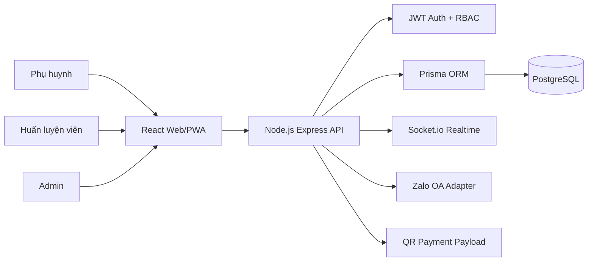

## Bản vá V9.1: sửa lỗi trùng mã học viên

Bản này sửa lỗi khi thêm học viên mới bị Prisma `P2002` ở trường `studentCode`.

Nguyên nhân: bản cũ sinh mã học viên dựa trên tổng số học viên (`count + 1`). Nếu dữ liệu đã từng xóa học viên, seed lại, hoặc đã có mã `FA20260001`, hệ thống có thể tạo lại mã đã tồn tại.

Cách sửa: hệ thống hiện tìm mã học viên lớn nhất theo năm hiện tại, sinh mã tiếp theo và tự retry nếu có trùng mã khi nhiều người thêm học viên cùng lúc.

Phiên bản kiểm tra tại `/api/health`:

```txt
biometric-face-iris-camera-v9-student-code-fix
```

# Football Academy Manager Pro – CLB MM Quy Nhơn Theme V8

Bản này cập nhật giao diện màu chủ đạo **xanh lá cây + cam** cho CLB MM Quy Nhơn và giữ nguyên các chức năng của bản QR động V6.

- Theme xanh lá cây: chuyên nghiệp, thể thao, hiện đại.
- Accent cam: năng lượng, nổi bật CTA, QR và thao tác nhanh.
- Kiểm tra phiên bản: `/api/health` → `mm-quy-nhon-green-orange-theme-v8`.

Xem thêm: `MM_QUY_NHON_THEME_V8.md`.

---

# Football Academy Manager Pro – Coach Payroll V5

Bản này bổ sung module **Chấm công & tính lương Huấn luyện viên**. Admin có thể chấm công HLV, tính lương theo tháng, chốt lương và đánh dấu đã thanh toán. Tài khoản HLV có thể tự xem chấm công và bảng lương của mình.

Kiểm tra bản đúng tại `/api/health`: `version = mm-quy-nhon-green-orange-theme-v8`. Xem thêm `COACH_PAYROLL_UPGRADE_V5.md`.

---

# Football Academy Manager Pro – Render Parent Portal V4

**BẢN DÙNG ĐỂ UPLOAD LÊN GITHUB/RENDER – ĐÃ CÓ QUYỀN PHỤ HUYNH.**

## Dấu hiệu nhận diện đúng bản V4

- API health trả về: `"version": "mm-quy-nhon-green-orange-theme-v8"`
- Menu Admin có: **Tài khoản phụ huynh** và **Lịch sử điểm danh**
- Admin tạo được tài khoản **Phụ huynh** trước, chưa cần gán con ngay
- Sau đó Admin có thể gán học viên là con trong danh sách phụ huynh

## Quyền tài khoản hiện có

- `ADMIN`: quản trị toàn hệ thống
- `COACH`: thao tác lớp được phân công
- `PARENT`: chỉ xem dữ liệu các con được gán, học phí, QR và thẻ học viên

## Upload GitHub quan trọng

ZIP này đã được dàn phẳng. Khi giải nén, hãy upload **các file/thư mục hiện ra ngay lập tức** (`backend`, `frontend`, `render.yaml`, `package.json`...) vào ngoài cùng repository GitHub. Không upload thêm một thư mục cha lồng bên ngoài.

---

# Football Academy Manager Pro - Instagram-like Online Upgrade

Bản này đã được nâng cấp giao diện mobile-first giống app hiện đại: bottom navigation, activity feed, quick actions, story bubble, single-port API và cấu hình deploy online HTTPS. Xem thêm `INSTAGRAM_LIKE_UPGRADE_GUIDE.md`.

---

# Football Academy Manager Pro - PWA Proxy Login Fixed

Bản này đã sửa lỗi đăng nhập khi mở trên iPhone/PWA bằng cách cho frontend gọi API qua cùng địa chỉ `/api`, rồi Docker/Vite proxy sang backend.

Chạy nhanh:

```bash
copy .env.example .env
docker compose down -v --remove-orphans
docker compose build --no-cache
docker compose up
```

Mở:

```txt
http://localhost:5173
http://localhost:5173/api/health
```

Tài khoản Admin: `admin@demo.com` / `Admin@123`

---

# Football Academy Manager Pro

Phần mềm quản lý học viên bóng đá cộng đồng dùng React + Vite + TailwindCSS, Node.js + Express, PostgreSQL, Prisma, Socket.io, JWT và Docker.

## Tài khoản demo sau khi seed

- Admin: `admin@demo.com` / `Admin@123`
- Huấn luyện viên: `coach@demo.com` / `Coach@123`

## Chạy nhanh bằng Docker

### Windows CMD/PowerShell

```bash
copy .env.example .env
docker compose up --build
```

### Mac/Linux/Git Bash

```bash
cp .env.example .env
docker compose up --build
```

Bản này tự tạo bảng database và tài khoản demo khi backend khởi động nhờ:

```bash
npx prisma db push
npx prisma db seed
```

Truy cập:

- Frontend: http://localhost:5173
- Backend API: http://localhost:4000/api/health
- PostgreSQL: localhost:5432

Nếu trước đó đã chạy bản cũ và đăng nhập bị `Lỗi hệ thống`, hãy reset database một lần:

```bash
docker compose down -v
docker compose up --build
```

## Chạy local để phát triển

### 1. Database

Cài PostgreSQL hoặc dùng Docker:

```bash
docker compose up db -d
```

### 2. Backend

```bash
cd backend
cp ../.env.example .env
npm install
npx prisma migrate dev --name init
npx prisma db seed
npm run dev
```

### 3. Frontend

```bash
cd frontend
npm install
npm run dev
```

## Kiến trúc tổng thể



## ERD rút gọn

```mermaid
erDiagram
  User ||--o{ Class : coaches
  User ||--o{ Student : creates
  Class ||--o{ Student : contains
  Class ||--o{ TrainingSchedule : has
  TrainingField ||--o{ TrainingSchedule : hosts
  Student ||--o{ Attendance : has
  Student ||--o{ Payment : pays
  Student ||--o{ UniformOrder : buys
  UniformOrder ||--o{ UniformOrderItem : includes
  UniformProduct ||--o{ UniformOrderItem : sold_as
  Student ||--o{ StudentNote : has
  Student ||--o{ ZaloMessage : receives
```

## Module chính

1. **Auth + phân quyền**
   - JWT Bearer token
   - Role: `ADMIN`, `COACH`
   - Admin quản lý toàn hệ thống
   - Coach chỉ xem và thao tác trong lớp của mình

2. **Quản lý học viên**
   - Mã học viên tự động
   - Hồ sơ học viên, phụ huynh, lớp, trạng thái học phí
   - Số buổi học đã học/còn lại

3. **Điểm danh**
   - Điểm danh nhanh trên điện thoại
   - Trạng thái: Có mặt, Vắng, Xin phép
   - Tự trừ buổi nếu có mặt
   - Có cơ chế sửa điểm danh để tránh trừ buổi sai

4. **Học phí**
   - Theo tháng hoặc gói buổi
   - Lịch sử thanh toán
   - Xác nhận thanh toán
   - Theo dõi còn nợ
   - Tạo nội dung QR chuyển khoản theo từng học viên

5. **Đồng phục**
   - Sản phẩm, size, tồn kho
   - Đơn bán đồng phục
   - Doanh thu đồng phục

6. **Dashboard**
   - Admin: tổng học viên, học viên nợ phí, doanh thu tháng, số lớp, điểm danh
   - HLV: lịch tập hôm nay, lớp phụ trách, điểm danh nhanh, học viên nghỉ học

7. **Zalo OA**
   - Có adapter mẫu trong `backend/src/modules/zalo`
   - Khi có OA chính thức, chỉ cần thay hàm gửi API thực tế, không đổi cấu trúc hệ thống

## API Structure

```txt
/api/auth/login
/api/auth/me
/api/users
/api/classes
/api/students
/api/attendance/bulk
/api/payments
/api/payments/overdue
/api/uniforms/products
/api/uniforms/orders
/api/dashboard/admin
/api/dashboard/coach
/api/zalo/send
```

## Authentication flow

1. Người dùng đăng nhập bằng email/password.
2. Backend kiểm tra mật khẩu bằng bcrypt.
3. Backend trả về JWT + thông tin user.
4. Frontend lưu token trong localStorage.
5. Mỗi request gửi `Authorization: Bearer <token>`.
6. Middleware backend kiểm tra token và gắn `req.user`.
7. Middleware `authorize()` kiểm tra quyền Admin/Coach.

## Responsive UI

- Mobile: menu dạng drawer, bảng chuyển thành card, nút lớn dễ bấm.
- Tablet: 2 cột thống kê, danh sách rộng hơn.
- Desktop: sidebar cố định, dashboard dạng grid 4 cột.

## Quy tắc nâng cấp không phá cấu trúc

- Không đổi tên thư mục module.
- Không đổi endpoint cũ nếu frontend đang dùng.
- Chỉ thêm field nullable khi mở rộng database.
- Mỗi tính năng mới thêm vào module riêng hoặc service riêng.
- Tất cả logic phân quyền đi qua middleware.

## Hướng nâng cấp tương lai

- PWA offline điểm danh rồi đồng bộ lại khi có mạng.
- App mobile bằng React Native dùng chung API.
- Zalo OA gửi tin nhắn thật.
- Upload ảnh học viên lên S3/Cloudflare R2.
- QR thanh toán VietQR chuẩn ngân hàng.
- Báo cáo PDF/Excel.
- Multi-branch: quản lý nhiều cơ sở/sân tập.
- Phụ huynh có tài khoản riêng để xem học phí và lịch tập.

## Lưu ý production

- Đổi `JWT_SECRET` trước khi deploy.
- Không commit file `.env`.
- Dùng HTTPS khi đưa lên server thật.
- Bật backup PostgreSQL hằng ngày.
- Thêm rate limit cho login.
- Thêm refresh token nếu triển khai mobile app.


## Cập nhật bản fix đăng nhập

Bản này đã cấu hình Docker tự chạy:

```bash
npx prisma db push
npx prisma db seed
```

ngay khi backend khởi động. Vì vậy lần đầu chạy chỉ cần:

```bash
copy .env.example .env
docker compose up --build
```

Nếu trước đó đã chạy bản cũ và bị lỗi đăng nhập, hãy reset database một lần:

```bash
docker compose down -v
docker compose up --build
```

Sau đó đăng nhập:

- Admin: `admin@demo.com` / `Admin@123`
- HLV: `coach@demo.com` / `Coach@123`

## Bản nâng cấp Admin tối ưu

Bản này bổ sung thêm các quyền và màn hình quản trị:

- Admin có trang **Cấu hình CLB** để thêm/đổi logo, tên CLB, tên rút gọn, hotline, địa chỉ.
- Logo hiển thị ở sidebar và header sau khi lưu.
- Admin có thể **thêm, sửa, xóa học viên** trực tiếp trong màn hình Học viên.
- Màn hình Học viên có tìm kiếm theo tên, mã học viên, SĐT phụ huynh và lọc theo lớp.
- HLV vẫn bị giới hạn trong phạm vi lớp mình phụ trách.
- Backend bổ sung API `/api/settings/academy` để lưu cấu hình CLB vào PostgreSQL.

Nếu anh nâng cấp từ bản cũ, nên reset database một lần để tạo bảng `AcademySetting`:

```bash

docker compose down -v

docker compose up --build

```

Sau đó đăng nhập lại:

```txt
Admin: admin@demo.com / Admin@123
HLV: coach@demo.com / Coach@123
```

## Bản nâng cấp: Class + Coach Delete + Student Card + Zalo OA

Bản này đã bổ sung thêm các module theo yêu cầu:

### 1. Admin quản lý lớp mạnh hơn
- Tạo lớp mới.
- Sửa lớp.
- Xóa lớp.
- Khi xóa lớp có học viên, học viên được chuyển về trạng thái `Chưa phân lớp` để không mất dữ liệu học viên.

### 2. Admin xóa huấn luyện viên
- Vào `Tài khoản`.
- Chỉ Admin mới xóa được HLV.
- Khi xóa HLV, các lớp HLV đó đang phụ trách sẽ chuyển thành `Chưa gán HLV`.
- Không cho xóa chính tài khoản đang đăng nhập.

### 3. Thẻ học viên
- Menu mới: `Thẻ học viên`.
- Thẻ hiển thị: logo CLB, tên CLB, mã học viên, họ tên, lớp, số điện thoại phụ huynh, số buổi còn lại.
- Có nút `In thẻ`.
- Hỗ trợ in nhiều thẻ theo danh sách lọc.

### 4. QR nộp học phí trên thẻ
- Vào `Cấu hình CLB`.
- Upload `QR nộp học phí`.
- Nhập ngân hàng, số tài khoản, chủ tài khoản và tiền tố nội dung chuyển khoản.
- QR này sẽ hiện trên `Thẻ học viên`.

### 5. Kết nối Zalo OA
- Menu mới: `Zalo OA`.
- Admin có thể lưu OA ID, Access Token, Refresh Token, ngày hết hạn.
- Có gửi thử tin nhắn demo và xem log tin nhắn.
- Bản local hiện lưu log demo để tránh gửi nhầm tin thật. Khi có Zalo OA thật và quyền API đầy đủ, chỉnh adapter trong `backend/src/modules/zalo/zalo.routes.ts` để gọi API Zalo thật.

### Chạy lại bản nâng cấp

Nếu nâng cấp từ bản cũ, nên reset database một lần:

```bash
copy .env.example .env
docker compose down -v
docker compose build --no-cache
docker compose up
```

Sau đó mở:

```txt
http://localhost:5173
```

Tài khoản demo:

```txt
Admin: admin@demo.com / Admin@123
HLV: coach@demo.com / Coach@123
```

## Nâng cấp mới: Báo cáo doanh thu + Excel + trạng thái gói buổi

Bản này đã thêm các chức năng:

- Menu **Báo cáo** cho Admin.
- Biểu đồ doanh thu theo tháng: 6 / 12 / 24 / 36 tháng gần nhất.
- Tách doanh thu **học phí** và **đồng phục**.
- Hiển thị tổng doanh thu, công nợ hiện tại, số học viên còn nợ.
- Nút **Xuất Excel** tải file `.xls`, mở trực tiếp bằng Microsoft Excel.
- Trang **Thẻ học viên** hiển thị trạng thái gói buổi tự động:
  - CHƯA NỘP TIỀN
  - ĐANG HỌC
  - GẦN HẾT BUỔI
  - HẾT BUỔI
  - QUÁ BUỔI
- Khi Admin xác nhận học phí dạng **gói buổi**, hệ thống tự cộng số buổi vào học viên và chỉ cộng một lần cho mỗi khoản thanh toán.

### Cách chạy bản nâng cấp

Nếu nâng từ bản cũ, nên reset database một lần vì schema có thêm trường `sessionsApplied`:

```bash
copy .env.example .env
docker compose down -v
docker compose build --no-cache
docker compose up
```

Sau đó mở:

```txt
http://localhost:5173
```

Tài khoản demo:

```txt
Admin: admin@demo.com / Admin@123
HLV: coach@demo.com / Coach@123
```

### Cách dùng báo cáo

Đăng nhập Admin → vào menu **Báo cáo** → chọn số tháng → bấm **Xuất Excel**.

### Cách dùng trạng thái gói buổi trên thẻ

Vào **Học phí** → chọn học viên → chọn loại phí **Gói buổi** → nhập số buổi → tạo học phí → Admin xác nhận thanh toán. Sau khi xác nhận, số buổi sẽ được cộng tự động và trạng thái trên thẻ học viên sẽ cập nhật theo số buổi còn lại.

## Nâng cấp mới: Kho đồng phục & dụng cụ + Liên kết HLV/Admin

### Kho đồng phục & dụng cụ

Menu `Kho đồ` hỗ trợ Admin:

- Thêm đồng phục: áo, quần, tất, bộ đồng phục.
- Thêm dụng cụ: bóng, cone/chóp, áo bib, thang dây, marker, vật tư khác.
- Sửa thông tin hàng tồn: tên, loại, size, SKU, giá, tồn kho, mức cảnh báo.
- Nhập thêm kho, xuất khỏi kho, chỉnh tồn thực tế.
- Xóa/ẩn hàng tồn: hàng bị xóa sẽ không còn xuất hiện trong danh sách bán, tồn kho về 0 nhưng lịch sử vẫn được giữ.
- Khôi phục hàng đã xóa.
- Xem cảnh báo sắp hết hàng và lịch sử xuất nhập kho.

HLV có thể tạo đơn bán đồng phục/dụng cụ cho học viên trong phạm vi dữ liệu được phân quyền.

### Liên kết HLV & Admin

Menu `Lớp của HLV` hỗ trợ:

- HLV xem các lớp được Admin gán.
- Admin xem toàn bộ lớp theo từng HLV.
- Theo dõi trạng thái điểm danh theo ngày: có mặt, vắng, xin phép, chưa điểm danh.
- Xem danh sách học viên, số buổi còn lại và lịch tập.
- HLV điểm danh ở menu `Điểm danh`; Admin xem lại ngay ở `Lớp của HLV`.

### Lưu ý khi nâng cấp từ bản cũ

Bản này có thêm enum và bảng mới cho kho:

- `InventoryTransactionType`
- `InventoryTransaction`
- mở rộng `UniformType` thêm `BALL`, `CONE`, `BIB`, `LADDER`, `MARKER`, `OTHER`
- thêm trường `sku`, `note`, `minStock`, `deletedAt` cho `UniformProduct`

Nên reset database một lần khi chạy bản mới:

```bash
docker compose down -v
docker compose build --no-cache
docker compose up
```

---

## Nâng cấp app điện thoại / PWA

Bản này đã có thể cài như app điện thoại theo chuẩn PWA.

### Android

Mở Chrome trên điện thoại:

```txt
http://IP_MAY_TINH:5173
```

Sau đó chọn:

```txt
⋮ → Thêm vào màn hình chính
```

hoặc bấm nút **Cài app ngay** trong giao diện.

### iPhone/iPad

Mở Safari:

```txt
http://IP_MAY_TINH:5173
```

Sau đó chọn:

```txt
Chia sẻ → Thêm vào Màn hình chính
```

### Hướng dẫn chi tiết

Xem file:

```txt
MOBILE_APP_GUIDE.md
```

Bản này cũng có sẵn cấu hình Capacitor để sau này build APK/iOS App thật.

## Nâng cấp mới: Lịch tập & phân bổ sân

Bản này có thêm menu **Lịch tập**.

Admin có thể:

- Thêm/sửa/xóa lịch tập.
- Phân bổ lịch theo lớp, HLV, sân và khung giờ.
- Thêm/xóa sân tập/địa điểm.
- Tự động chặn trùng sân hoặc trùng HLV trong cùng khung giờ.

HLV có thể:

- Xem lịch tập của lớp được Admin gán.
- Xem lịch trên Dashboard HLV và menu Lịch tập.

Xem thêm file `SCHEDULE_UPGRADE_GUIDE.md`.


## Nâng cấp Chatbot nội bộ

Bản này đã thêm nút chat nổi ở góc phải dưới màn hình. Admin/HLV có thể hỏi nhanh về học viên, học phí, lịch tập, điểm danh, kho đồ và doanh thu. Xem chi tiết trong `CHATBOT_UPGRADE_GUIDE.md`.


## Nâng cấp V6: QR học phí động theo số tiền Admin chọn

Bản V6 cho phép Admin nhập số tiền cần thu, ví dụ `500000`, hệ thống tự tạo QR ngân hàng đúng số tiền `500.000đ`, liên kết với tài khoản ngân hàng đã cấu hình trong **Cấu hình CLB**.

- Cấu hình thêm `Mã BIN ngân hàng`, số tài khoản và chủ tài khoản.
- Trang **Quản lý học phí** có phần xem trước QR động.
- Mỗi khoản học phí lưu QR riêng trong `Payment.qrPayload`.
- Phụ huynh thấy QR đúng số tiền còn nợ trong **Cổng phụ huynh**.
- Admin vẫn cần xác nhận thanh toán sau khi nhận tiền.

Kiểm tra bản đúng tại `/api/health` phải thấy:

```txt
mm-quy-nhon-green-orange-theme-v8
```

Xem thêm `DYNAMIC_BANK_QR_UPGRADE_V6.md`.
